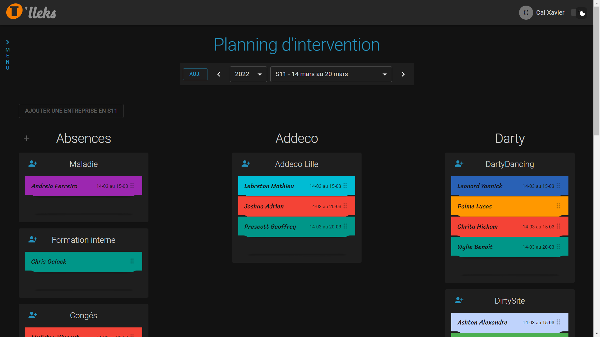

# O'lleks

A planning handling tool allowing registered users to either manage their staff and create plannings, or recover affectations informations depending on their status.



## Features

(Depending on the status)

- Global display of every sites and employees (sorted weekly)
- Re-affectation of an employee with a **drag&drop** system (Desktop only)
- Possibility of creating plannings for following weeks
- Creation, update and deletion of an employee, site or a company
- Absence management
- Archive system
- Responsive design: accessible on any devices
- Light mode, dark mode

## Lexicon

School project developped to answer the needs of a specific company who still uses T-sheets paper planners, the terms and uses of the application are specific to said company. Here's a quick rundown:

- ```admin``` A role given upon registration to the users in charge of affecting an employee to a production site. Their permissions allow them to create, update or delete an affectation, an employee, a production site or a company.
- ```user``` A role given upon registration to the employees of the company. Their permissions allow them to consult their weekly plannings.
- ```employee``` Any employee of the company using the application.
- ```site``` The production sites the company using the application are operating *(or operated)* on. Production sites belong to a company.
- ```client/company``` All the companies the company using the application are working *(or worked)* with.

## Technologies

Built with **React**, **React-Redux**, and **Material UI**. Runs on **NodeJs**, with our database hosted on **Heroku**.

## Setup

After cloning, to install the project's dependencies :

```nodejs
cd server/
npm i
npm run dev

cd client/
yarn
yarn start
```

Using ```npm run start``` to start the server and ```yarn start``` to launch the React application, you'll then have access to the application via your localhost:3000.
